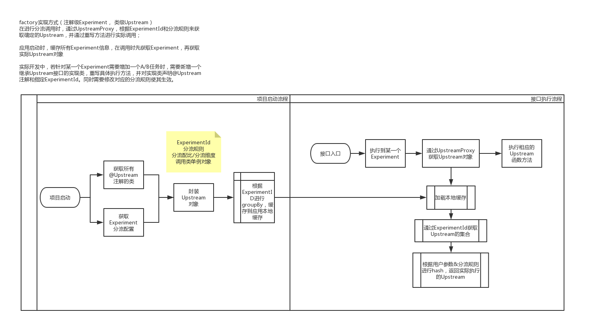

## 应用A/B Test测试框架

### Proxy实现方式
>注解级别Experiment， 类级别Upstream

#### 流程图

#### 应用启动流程
应用启动时，获取所有注解@Upstream注解的实现类，以及Experiment分流规则，将信息封装为Upstream对象
。根据ExperimentID进行groupBy，缓存到应用本地缓存中；

#### 接口执行过程
在进行分流调用时，通过UpstreamProxy，根据ExperimentId和分流规则来获取确定的Upstream，并通过重写方法进行实际调用；

#### 开发维护
实际开发中，若针对某一个Experiment需要增加一个A/B任务时，需要新增一个继承Upstream接口的实现类，重写具体执行方法，并对实现类声明@Upstream注解和指定ExperimentId。同时需要修改对应的分流规则使其生效。